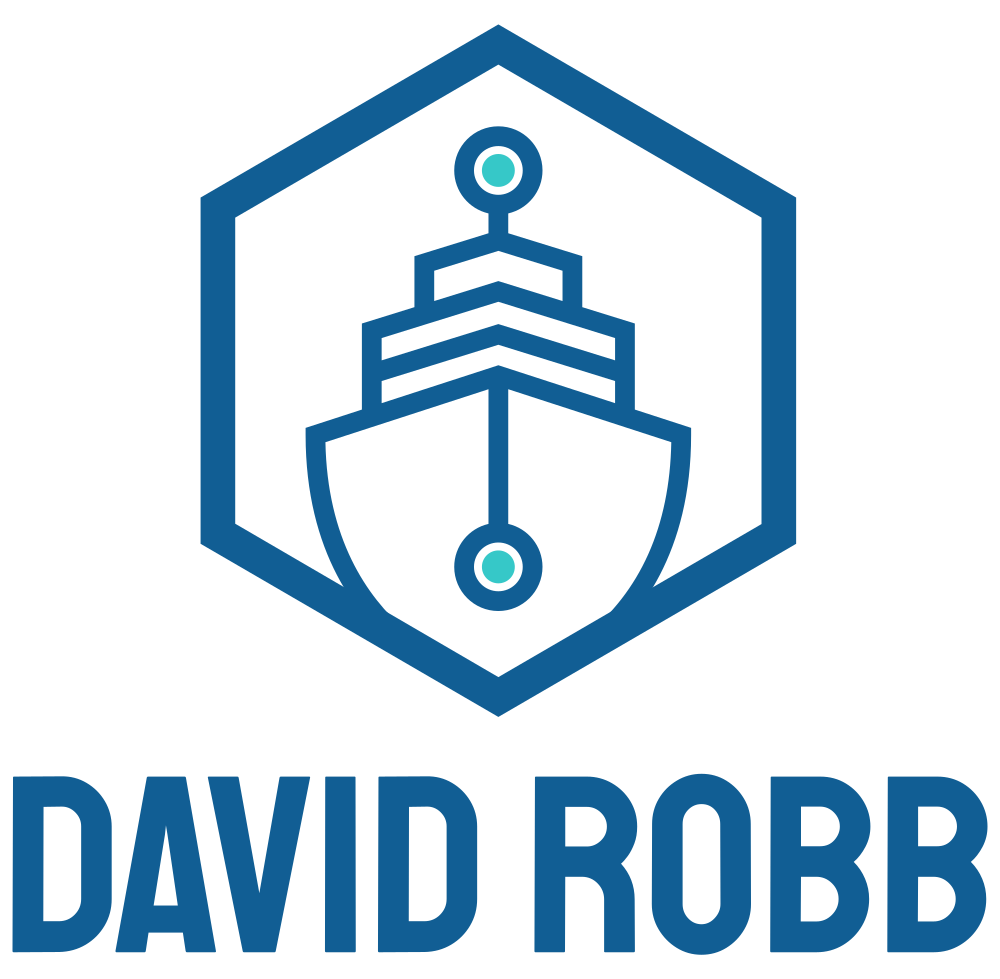
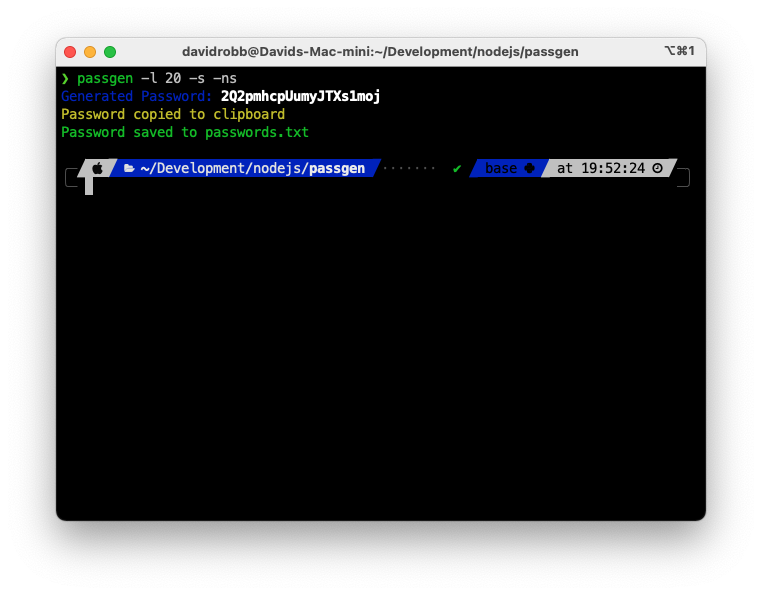
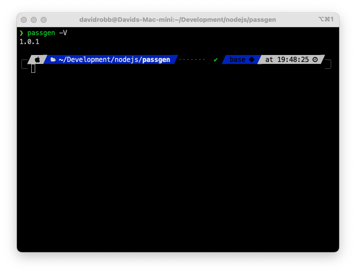
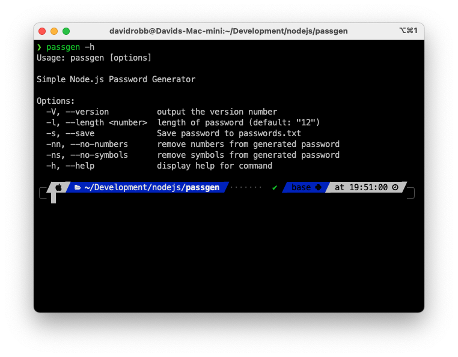

<!--
*** Thanks for checking out the Best-README-Template. If you have a suggestion
*** that would make this better, please fork the passgen and create a pull request
*** or simply open an issue with the tag "enhancement".
*** Thanks again! Now go create something AMAZING! :D
***
***
***
*** To avoid retyping too much info. Do a search and replace for the following:
*** drobb2020, passgen, twitter_handle, email, Passgen, A simple password generator using Node.js
-->

<!-- PROJECT SHIELDS -->
<!--
*** I'm using markdown "reference style" links for readability.
*** Reference links are enclosed in brackets [ ] instead of parentheses ( ).
*** See the bottom of this document for the declaration of the reference variables
*** for contributors-url, forks-url, etc. This is an optional, concise syntax you may use.
*** https://www.markdownguide.org/basic-syntax/#reference-style-links
-->

[![Contributors][contributors-shield]][contributors-url]
[![Forks][forks-shield]][forks-url]
[![Stargazers][stars-shield]][stars-url]
[![Issues][issues-shield]][issues-url]
[![MIT License][license-shield]][license-url]
[![LinkedIn][linkedin-shield]][linkedin-url]

<!-- PROJECT LOGO -->
<br />
<p align="center">
  <a href="https://github.com/drobb2020/readme-template">
    
  </a>

  <h3 align="center">Passgen</h3>

  <p align="center">
    A simple password generator using Node.js
    <br />
    <a href="https://github.com/drobb2020/passgen"><strong>Explore the docs »</strong></a>
    <br />
    <br />
    <a href="https://github.com/drobb2020/passgen">View Demo</a>
    ·
    <a href="https://github.com/drobb2020/passgen/issues">passgenrt Bug</a>
    ·
    <a href="https://github.com/drobb2020/passgen/issues">Request Feature</a>
  </p>
</p>

<!-- TABLE OF CONTENTS -->
<details open="open">
  <summary><h2 style="display: inline-block">Table of Contents</h2></summary>
  <ol>
    <li>
      <a href="#about-the-project">About The Project</a>
      <ul>
        <li><a href="#built-with">Built With</a></li>
      </ul>
    </li>
    <li>
      <a href="#getting-started">Getting Started</a>
      <ul>
        <li><a href="#prerequisites">Prerequisites</a></li>
        <li><a href="#installation">Installation</a></li>
      </ul>
    </li>
    <li><a href="#usage">Usage</a></li>
    <li><a href="#roadmap">Roadmap</a></li>
    <li><a href="#contributing">Contributing</a></li>
    <li><a href="#license">License</a></li>
    <li><a href="#contact">Contact</a></li>
    <li><a href="#acknowledgements">Acknowledgements</a></li>
  </ol>
</details>

<!-- ABOUT THE PROJECT -->
## About The Project



This is a simple password generator where you can change the length, and strength of the password when you run the commands below. Enjoy!

### Built With

* [Node.js](https://nodejs.org/en/)
* [Commander](https://www.npmjs.com/package/commander)
* [Chalk](https://www.npmjs.com/search?q=chalk)
* [Clipboardy](https://www.npmjs.com/package/clipboardy)

<!-- GETTING STARTED -->
## Getting Started

To get a local copy up and running follow these simple steps.

### Prerequisites

This project requires Node.js be installed on your machine. The OS does not matter (this was created on a Mac M1).

* npm

  ```sh
  npm install npm@latest -g
  ```

### Installation

1. Clone the passgen

   ```sh
   git clone https://github.com/drobb2020/passgen.git
   ```

2. Install NPM packages

   ```sh
   npm install
   ```

3. Create a symlink for the process

   ```sh
   npm link
   ```

4. You can now run the command passgen \<options\> from anywhere on your machine.

<!-- USAGE EXAMPLES -->
## Usage

As this is a simple password generator and lacks some of the sophistication of commercially available password generators this should be considered a demo of what you can do with commander, chalk, and clipboardy. As an enhancement to this project I will be adding a way to calculate the entropy of the generated password. Coming soon!

### Current Version



Version: 1.0.1

### Options



| short | Long | Description |
|-------|------|-------------|
| -l    | --length | Length of password (default: 12) |
| -s | --save | Save the password to passwords.txt |
| -nn | --no-numbers | Exclude numbers from the generated password |
| -ns | --no-symbols | Exclude symbols from the generated password |
| -h | --help | Display this help message |
| -V | --version | Show version |

_For more examples, please refer to the original video by [Brad Traversy](https://www.youtube.com/watch?v=3Xx83JAktXk)_

<!-- ROADMAP -->
## Roadmap

See the [open issues](https://github.com/drobb2020/passgen/issues) for a list of proposed features (and known issues).

<!-- CONTRIBUTING -->
## Contributing

Contributions are what make the open source community such an amazing place to be learn, inspire, and create. Any contributions you make are **greatly appreciated**.

1. Fork the Project
2. Create your Feature Branch (`git checkout -b feature/AmazingFeature`)
3. Commit your Changes (`git commit -m 'Add some AmazingFeature'`)
4. Push to the Branch (`git push origin feature/AmazingFeature`)
5. Open a Pull Request

<!-- LICENSE -->
## License

Distributed under the MIT License. See `LICENSE` for more information.

<!-- CONTACT -->
## Contact

David Robb - [@DavidRobb2](https://twitter.com/DavidRobb2) - drobb2011@gmail.com

Project Link: [https://github.com/drobb2020/passgen](https://github.com/drobb2020/passgen)

<!-- ACKNOWLEDGEMENTS -->
## Acknowledgements

* [Traversy Media](https://www.youtube.com/channel/UC29ju8bIPH5as8OGnQzwJyA)
* [YouTube Video](https://www.youtube.com/watch?v=3Xx83JAktXk)

<!-- MARKDOWN LINKS & IMAGES -->
<!-- https://www.markdownguide.org/basic-syntax/#reference-style-links -->
[contributors-shield]: https://img.shields.io/github/contributors/drobb2020/passgen.svg?style=for-the-badge
[contributors-url]: https://github.com/drobb2020/passgen/graphs/contributors
[forks-shield]: https://img.shields.io/github/forks/drobb2020/passgen.svg?style=for-the-badge
[forks-url]: https://github.com/drobb2020/passgen/network/members
[stars-shield]: https://img.shields.io/github/stars/drobb2020/passgen.svg?style=for-the-badge
[stars-url]: https://github.com/drobb2020/passgen/stargazers
[issues-shield]: https://img.shields.io/github/issues/drobb2020/passgen.svg?style=for-the-badge
[issues-url]: https://github.com/drobb2020/passgen/issues
[license-shield]: https://img.shields.io/github/license/drobb2020/passgen.svg?style=for-the-badge
[license-url]: https://github.com/drobb2020/passgen/blob/master/LICENSE.txt
[linkedin-shield]: https://img.shields.io/badge/-LinkedIn-black.svg?style=for-the-badge&logo=linkedin&colorB=555
[linkedin-url]: https://www.linkedin.com/in/david-robb-42436a20/
